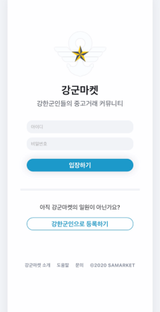
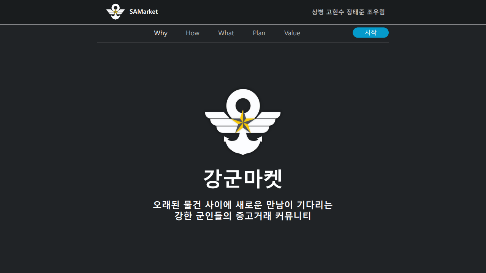
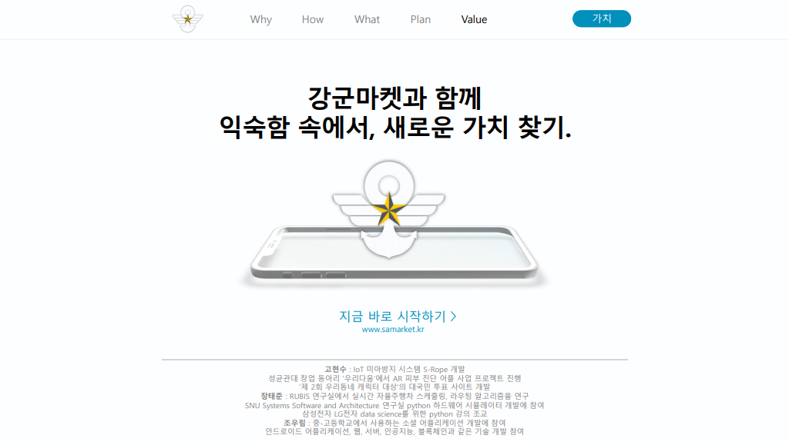
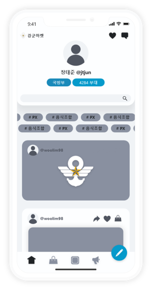

<center>


[](https://samarket.kr)

</center>

# 강군마켓 
 
[](https://opensource.org/licenses/MIT)

### 강한 군인들만의 영내 중고거래 커뮤니티 

<center>

## https://samarket.kr/

[](https://samarket.kr/)

</center>

<br>

## 📜 프로젝트 설명 (Project Description)
   
#### 코로나19로 힘든 시기를 보내고 있는 장병들을 도와주자
코로나19로 인한 ‘사회적 거리 두기’ 실시에 따른 출타 제한으로 인해 현역 장병들은 정신적인 스트레스 뿐만 아니라, 필요한 물품이나 외부 물자를 얻기 어려운 문제를 겪고 있습니다. 이에 저희 강군마켓은 비교적 이동이 자유로운 영내 중고거래 및 정보공유를 활성화함으로써, 장병들이 힘든 시기를 극복하는데 도움이 되고자 합니다. 저희 서비스의 사용자인 현역 장병들은 필요한 물품뿐만 아니라 새로운 사람과 정보를 얻고, 활력을 되찾을 수 있을 것으로 기대하고 있습니다. 
   
#### 모두가 신뢰할 수 있는 안심 거래 서비스 구축 
강군마켓의 핵심 서비스는 영내 중고거래입니다. 영내 중고거래의 장점은 출타 제한에 따른 영향을 받지 않는다는 점입니다. 또한, 같은 영내에 있는 사람끼리 거래하기 때문에, 높은 신뢰성을 확보할 수 있습니다. 이에 더해 저희 팀은 거래자 간의 상호평가뿐만 아니라 같은 부대 내 ‘전우의 평가’ 시스템으로 거래 품목의 품질에 대한 신뢰성까지 확보할 수 있을 것으로 기대됩니다.
   
#### 커뮤니티를 통해 장병들의 소통 활성화
강군마켓의 소통 커뮤니티는 자신이 판매하거나, 필요한 물품을 게시글로 올리는 것에서 시작합니다. 더 나아가 거래 후기를 올리고, 영내에서 활용할 수 있는 유용한 정보를 장병들끼리 서로 공유할 수 있을 것입니다. 이를 통해 정보의 선순환과 건강한 커뮤니티 문화를 형성할 수 있을 것입니다. 
 
<br>


## 📽️ 시연 동영상 (Demo Video)


<br>

## 🎁 발표 동영상 (Presentation Video)

<center>

[](http://tinyurl.com/samarketvideo)

</center>

<br>

## 🚀 소개 자료 (Presentation)

<center>

[PDF 버전](PPT/강군마켓.pdf)

[PPT 버전](PPT/강군마켓.pptx)



(PPT 는 "읽기 전용"파일 입니다. 편집이 불가능 합니다.)

</center>

<br>

## 📌 필요 사양 (Prerequisites)
* ECMAScript 6 지원 브라우저 사용
* 권장: Google Chrome 버젼 77 이상

<br>


## 🛠️ 기능 설계 (Function Design)
- [Adobe XD](https://www.tinyurl.com/samxdclr)

<center>

 [](https://www.tinyurl.com/samxdclr)   


</center>


#### PWA를 활용한 사용자 경험 최적화
본 프로젝트는 Golang RESTful API 서버와 React Framework를 활용해 PWA(Progressive Web App)로 개발되었습니다. 이를 통해 강군마켓은 웹과 네이티브 앱의 이점을 모두 취할 수 있으며, 시스템 알림, 푸시 메시지 등 스마트폰에 최적화된 UI를 제공하면서 동시에 웹의 유용한 기능을 끌어와 데이터와 시간을 효과적으로 절약할 수 있습니다. PWA는 네이티브 앱과 비교했을 때 앱스토어에서 다운로드할 필요가 없으므로 강군마켓의 출시 및 공유가 더 용이하며, 빌드하는 것이 훨씬 빠르고 쉽기 때문에 네이티브 앱 개발보다 저렴하고 가볍다는 장점이 있습니다. 인터넷 연결이 끊긴 오프라인 상태라도 이용자에게 점진적 웹 응용 프로그램을 제공합니다. 또한 기종에 상관없이 어느 스마트폰에서나 작동할 수 있기 때문에 강군마켓 서비스에 대한 높은 호환성을 보장할 수 있습니다.

<br>

## 🧪 기술 스택 (Technique Used)

### Frontend
 -  [React.js](https://ko.reactjs.org/)
 -  [Redux](https://ko.redux.js.org/)

### Backend
 -  Go + [Gin](https://github.com/gin-gonic/gin)
 -  [MariaDB](https://mariadb.com/)
 -  [Gorm](https://gorm.io/ko_KR/)
 -  Swagger + [Swaggo](https://github.com/swaggo/swag)

### 🐳Docker
  - [bitnami/mariadb](https://github.com/bitnami/bitnami-docker-mariadb)
  - [Golang](https://hub.docker.com/_/golang)
  
<br>

## 🧱 파일 구조 (File Structure)

```sh
WEB_SAMarket_SAMarket
│  docs
│  .gitignore
│  license.md
│  readme.md
│
├─frontend  //react
│   ├─.gitignore
│   ├─.prettierrc
│   ├─jsconfig.json
│   ├─package.json
│   ├─yarn.lock
│   ├─readme.md
│   ├─public
│   └─src
│       ├─index.js
│       ├─index.css
│       ├─serviceWorker.js
│       ├─setupTests.js
│       ├─imgs
│       ├─api
│       │  index.js
│       │
│       ├─data
│       │  chats.json
│       │  rates.json
│       │  replies.json
│       │  samroads.json
│       │  users.json
│       │
│       └─views
│           ├─components
│           │    ├─  aboutUs
│           │    ├─  base
│           │    ├─  chat
│           │    ├─  header
│           │    ├─  menubar
│           │    ├─  post
│           │    ├─  profile
│           │    ├─  rate
│           │    ├─  tag
│           │    ├─  user
│           │    └─ write
│           ├─modules
│           │    ├─  chat
│           │    ├─  common
│           │    ├─  friend
│           │    ├─  samroad
│           │    ├─  search
│           │    ├─  sign
│           │    ├─  animation.css
│           │    └─  index.js
│           └─pages    
│                ├─  Pages.css
│                ├─  chatPages
│                ├─  postPages
│                ├─  profilePages
│                ├─  signPages
│                ├─  tempPages
│                ├─  index.js
│                ├─  LikePage.js
│                └─  MainPage.js
│
└─backend  //golang
    ├─.gitignore
    ├─LICENSE
    ├─Makefile
    ├─debug.yaml
    ├─go.mod
    ├─go.sum
    ├─main.go
    ├─docs
    ├─api
    │  ├─api.go
    │  ├─auth.go
    │  ├─chat.go
    │  ├─comment.go
    │  ├─error.go
    │  ├─noti.go
    │  ├─post.go
    │  ├─requests.go
    │  ├─results.go
    │  ├─review.go
    │  ├─unit.go
    │  ├─upload.go
    │  └─cuser.go
    │
    ├─config
    │  ├─config.go
    │  ├─go.mod
    │  └─go.sum
    │
    ├─middleware
    │  ├─middleware.go
    │  ├─go.mod
    │  └─go.sum
    │
    ├─models
    │  ├─chat.go
    │  ├─comment.go
    │  ├─noti.go
    │  ├─post.go
    │  ├─image.go
    │  ├─review.go
    │  ├─unit.go
    │  ├─user.go
    │  ├─go.mod
    │  ├─go.sum
    │  └─modles.go
    │
    └─ws
       ├─client.go
       ├─events.go
       ├─hub.go
       ├─ws.go
       ├─go.mod
       └─go.sum
                        
```
<br>

## 📚 REST API 목록 (REST API List)
[Swaggo]([https://github.com/swaggo/swag](https://github.com/swaggo/swag))를 사용하여 코드에 맞게 Swagger 설정 파일이 자동으로 업데이트 됩니다. 현재 API 목록은 아래 링크에서 확인하실 수 있습니다.
- Swagger UI   
https://samarket.kr/swagger/index.html

<br>

## 💻 설치 및 실행하기 (Installation & Setup)
강군마켓 Backend는 Golang과 Mariadb, Frontend는 Node.js를 사용해야 개발되었습니다. 서버 실행시에 필요 프로그램들을 먼저 설치하는 작업이 필요합니다.

### Frontend
#### 1. node 및 yarn 설치
```bash
$ curl -sL https://deb.nodesource.com/setup_14.x | sudo -E bash -
$ sudo apt install nodejs
$ npm install -g yarn
```
#### 2. 프론트엔드 실행
```bash
$ git clone https://github.com/osamhack2020/WEB_SAMarket_SAMarket.git
$ cd frontend
$ yarn install
$ yarn start
```
### Backend
#### 1. Golang 설치
```bash
$ wget https://dl.google.com/go/go1.15.2.linux-amd64.tar.gz 
$ sudo tar -xvf go1.15.3.linux-amd64.tar.gz 
$ sudo mv go /usr/local    
$ export GOROOT=/usr/local/go 
$ export PATH=$GOROOT/bin:$PATH 
```
#### 2. mariadb 설치
```bash
$ sudo apt install mariadb-server
```
#### 3. 실행 Config 수정

서버 실행 환경에 맞게 config를 수정합니다.

```yaml
# 샘플 설정 파일
server:
  host: 서버 실행 host
  port: 서버 포트
  mode: 실행 모드 (debug 또는 prod)
  timeout: 서버 타임아웃 설정
    server: 30
    read: 15
    write: 10
    idle: 5

key:
  crypt: 비밀번호 암호화 시 사용할 salt

db: db 접속 정보
  host: db 호스트
  port: db 포트
  username: db 유저 아이디
  password: db 유저 비번
  database: db 이름
```
#### 4. 프론트엔드 빌드
```bash
$ cd frontend
$ yarn build
```
#### 5. 서버 실행
config_name을 원하는 설정 파일 이름으로 바꾸고 (ex: debug) 실행합니다. 기본값은 debug 입니다.
```bash
$ git clone https://github.com/osamhack2020/WEB_SAMarket_SAMarket.git
$ cd backend
$ export SA_RUN=config_name make run
```
## 🐳Docker를 사용한 실행 환경 구축하기
강군마켓의 프로젝트는 Docker를 이용하여 개발되었고, 강군마켓을 손 쉽게 실행할 수 있도록 docker-compose 와 샘플 sql를 제공하고 있습니다. Docker를 이용하면 손 쉽게 강군마켓을 체험해 볼 수 있습니다.
#### 1. 도커 설치
[https://docs.docker.com/get-docker/](https://docs.docker.com/get-docker/)
#### 2. docker-compose로 강군마켓 실행
```bash
git clone https://github.com/osamhack2020/WEB_SAMarket_SAMarket samarket
cd samarket
docker-compose up -d
curl localhost:8090 // 서버 접속이 되는지 확인
```
위와 같이 입력한 후 localhost:8090로 접속하면 강군마켓 실행을 확인할 수 있습니다.

<br>

## ❤️ 팀 정보 (Team Information)
- 고현수 Hyunsu Ko (sce06147@naver.com), Github Id: KoHyunsu
- 장태준 Taejun Jang (jtjun@gmail.com), Github Id: jtjun
- 조우림 Woolim Cho (2680v4@gmail.com), Github Id: jkl5616

<br>

## 🔒 저작권 및 사용권 정보 (Copyleft / End User License)
 * [MIT](https://github.com/osamhack2020/WEB_SAMarket_SAMarket/blob/master/license.md)
---
Copyright (c) 2020 SAMarket

Permission is hereby granted, free of charge, to any person obtaining a copy of this software and associated documentation files (the "Software"), to deal in the Software without restriction, including without limitation the rights to use, copy, modify, merge, publish, distribute, sublicense, and/or sell copies of the Software, and to permit persons to whom the Software is furnished to do so, subject to the following conditions:

The above copyright notice and this permission notice shall be included in all copies or substantial portions of the Software.

THE SOFTWARE IS PROVIDED "AS IS", WITHOUT WARRANTY OF ANY KIND, EXPRESS OR IMPLIED, INCLUDING BUT NOT LIMITED TO THE WARRANTIES OF MERCHANTABILITY, FITNESS FOR A PARTICULAR PURPOSE AND NONINFRINGEMENT. IN NO EVENT SHALL THE AUTHORS OR COPYRIGHT HOLDERS BE LIABLE FOR ANY CLAIM, DAMAGES OR OTHER LIABILITY, WHETHER IN AN ACTION OF CONTRACT, TORT OR OTHERWISE, ARISING FROM, OUT OF OR IN CONNECTION WITH THE SOFTWARE OR THE USE OR OTHER DEALINGS IN THE SOFTWARE.

<br>
